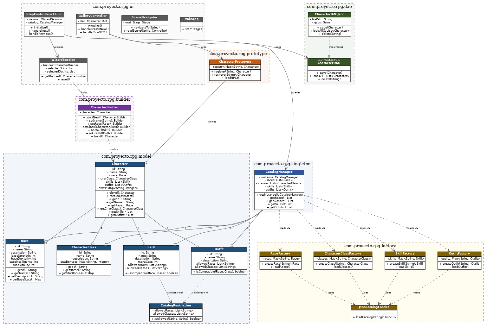

# RPG Character Creator — Proyecto de Diseño de Software (Corte 1)

Repositorio: [`vykymoon/rpg-character-creator`](https://github.com/vykymoon/rpg-character-creator)

---

## 1. Presentación del Problema

**¿Cuál es el problema y a quién afecta?**

Crear un personaje en un sistema de rol (RPG) de mesa o digital es una barrera de entrada real, no solo una molestia menor. Le pasa a dos tipos de jugador distinto:

- **Al jugador nuevo**, que se enfrenta a una lista larga de razas, clases, habilidades y equipo sin saber qué combinación tiene sentido, y termina en parálisis de decisión antes de haber jugado un solo turno.
- **Al jugador experimentado**, que sabe lo que quiere pero comete errores de reglas al armar el personaje a mano: combinaciones raza/clase que el sistema no permite, cálculos de estadísticas mal hechos, equipo que no debería estar disponible para su clase.

**¿Por qué es relevante resolverlo con software (y no con otro medio)?**

Una hoja de personaje en papel o una plantilla de Word no valida nada — el jugador puede escribir cualquier combinación, válida o no, y el error solo se detecta (si se detecta) cuando ya está jugando. El software puede conocer las reglas del sistema, validarlas en el momento de la elección, y calcular automáticamente las estadísticas derivadas. Esto no es un caso hipotético: es exactamente el problema que resuelven herramientas comerciales como HeroLab o el Character Manager de D&D Beyond para sistemas como D&D o Pathfinder.

**¿Cuál es el alcance de este módulo?**

Corte 1 entrega el **wizard de creación de personaje** end-to-end: selección de nombre y raza, clase, habilidades, equipo, y resumen final con guardado. Incluye:

- Validación de combinaciones raza/clase/habilidad/equipo según un catálogo definido en JSON.
- Cálculo automático de estadísticas (base de la raza + bonificaciones de la clase).
- Persistencia del personaje creado (guardar, listar, eliminar).
- Clonación de personajes ya creados como plantillas rápidas (NPCs).

**Fuera de alcance en este corte:**
- Sistema de combate o progresión de nivel del personaje ya creado.
- Multijugador o sincronización entre varios usuarios.
- Editor de catálogo desde la UI (las razas/clases/habilidades se editan hoy solo vía JSON, no desde una pantalla de administración).

## 2. Creatividad en la Presentación

Subida a Teams

Referencia usada para justificar el problema de sobrecarga de opciones en creación de personajes: el episodio *"Choice Paralysis — Too Much of a Good Thing"* de Extra Credits, que aborda explícitamente la creación de personajes como caso de estudio de diseño de UX en videojuegos.

## 3. Fundamentos de Ingeniería de Software

| Atributo de calidad | ¿Cómo se sostiene en el diseño? (evidencia concreta) | ¿Qué se sacrificó a cambio? |
|---|---|---|
| **Mantenibilidad** | La interfaz `CharacterDAO` separa la lógica de negocio de la persistencia. Cambiar de JSON a SQLite implica crear `CharacterDAOSqlite implements CharacterDAO`, sin tocar la UI ni el `CharacterBuilder`. | Una capa extra de indirección: para entender cómo se guarda un personaje hay que seguir la interfaz hasta su implementación, en vez de ver el código directo. |
| **Extensibilidad** | `RaceFactory`, `CharacterClassFactory`, `SkillFactory` y `OutfitFactory` leen su catálogo desde archivos JSON (`races.json`, `classes.json`, etc.) en vez de tener un `switch` con las opciones escritas en Java. Agregar una raza nueva es agregar una entrada al JSON. | El catálogo pierde el chequeo de tipos del compilador: un error de tipeo en el JSON (`"itnelligence"` en vez de `"intelligence"`) solo se detecta en tiempo de ejecución, no en compilación. |
| **Consistencia de datos** | `CatalogManager` es un Singleton que carga el catálogo una sola vez y lo comparte entre todas las pantallas del wizard. Ninguna pantalla puede tener una copia desactualizada del catálogo. | Estado global compartido: si algo modifica el catálogo en memoria durante la ejecución, todas las pantallas lo ven — hay que ser disciplinado para no mutar esas listas por accidente. |
| **Corrección de reglas de negocio** | `CatalogRestriction` centraliza la validación de si una habilidad o un equipo está permitido para una raza/clase dada, en vez de repetir esa lógica en cada controlador del wizard. | Un punto único de fallo: si `CatalogRestriction` tiene un bug, afecta la validación de habilidades **y** de equipo a la vez. |

## 4. Diseño de Software

### 4.1 Principios SOLID aplicados

#### Antes / Después — Open/Closed Principle

```text
❌ ANTES (violación hipotética): RaceFactory con un switch codificado
   public static Race createRace(String id) {
       switch (id) {
           case "humano": return new Race("humano", "Humano", 10, 10, 10, 10);
           case "elfo":   return new Race("elfo", "Elfo", 8, 15, 12, 8);
           // agregar una raza nueva = editar y recompilar esta clase
       }
   }
   Problema: cada raza nueva obliga a tocar y recompilar RaceFactory.java.
   El catálogo de razas queda mezclado con la lógica que las construye,
   y cualquier error de tipeo en un valor numérico requiere un nuevo build.

✅ DESPUÉS (aplicando OCP): RaceFactory data-driven
   public static Race createRace(String id) {
       RaceDefinition definition = definitions().get(normalize(id));
       if (definition == null) {
           throw new IllegalArgumentException("Raza no soportada: '" + id + "'.");
       }
       return build(definition);
   }
   // Las razas viven en src/main/resources/data/races.json:
   // { "id": "elfo", "name": "Elfo", "baseStrength": 8, "baseDexterity": 15, ... }

   Por qué resuelve el problema: agregar, quitar o ajustar una raza es
   editar el JSON — RaceFactory.java no cambia. La clase está cerrada a
   modificación pero abierta a extensión del catálogo.
```
Archivo: `factory/RaceFactory.java` + `src/main/resources/data/races.json`.

#### Dependency Inversion Principle

`CharacterDAO` es la abstracción de la que depende todo el resto del sistema; `CharacterDAOJson` es solo un detalle de implementación:

```java
// dao/CharacterDAO.java — abstracción de la que dependen UI y lógica de negocio
public interface CharacterDAO {
    void save(Character character);
    Optional<Character> findById(String id);
    List<Character> findAll();
    void delete(String id);
    boolean existsByName(String name);
}
```

```java
// ui/GalleryController.java — depende del tipo abstracto, no del concreto
private final CharacterDAO characterDAO = new CharacterDAOJson();
```

La variable se declara como `CharacterDAO` (la interfaz); `CharacterDAOJson` solo aparece a la derecha del `new`. Ningún controlador pregunta si el guardado es en JSON o en otra cosa — dependen de la abstracción, no de la implementación. Aplica en `GalleryController`, `Step5SummaryController` y `TemplateGalleryController`.

#### Single Responsibility Principle

El wizard está partido en un controlador por pantalla (`Step1NameRaceController`, `Step2ClassController`, `Step3SkillsController`, `Step4OutfitController`, `Step5SummaryController`) en vez de un único `WizardController` gigante. `Step2ClassController` solo sabe llenar el combo de clases, validar la selección y avanzar de pantalla — no sabe nada de JSON ni de otras pantallas. Archivo: `ui/Step2ClassController.java`.

### 4.2 Patrones de diseño utilizados

| Patrón | Categoría | Problema que resuelve aquí | Por qué no se usó [alternativa] |
|---|---|---|---|
| **Builder** (`CharacterBuilder`) | Creacional | `Character` tiene muchos campos opcionales/incrementales (nombre, raza, clase, lista de habilidades, lista de equipo) que se van llenando pantalla por pantalla del wizard. `CharacterBuilder` permite construirlo paso a paso y validar antes de `build()`. | Se descartó un constructor telescópico o un `Character` con muchos setters públicos: con 5+ campos opcionales, un constructor con todos los parámetros se vuelve ilegible y no valida el orden de creación del wizard. |
| **Factory Method** (`RaceFactory`, `CharacterClassFactory`, `SkillFactory`, `OutfitFactory`) | Creacional | Crear instancias de `Race`, `CharacterClass`, `Skill`, `Outfit` sin acoplar el cliente (UI, `CatalogManager`) a la construcción concreta, y permitiendo que el catálogo crezca vía JSON. | Se descartó Abstract Factory porque no hay familias de objetos relacionados que deban crearse juntas — cada factory produce un solo tipo de objeto de forma independiente. |
| **Prototype** (`CharacterPrototype`) | Creacional | Clonar un `Character` ya creado (por ejemplo, para generar NPCs rápido a partir de una plantilla base) sin repetir todo el proceso del wizard ni el `CharacterBuilder`. | Se descartó reconstruir el personaje desde cero con `CharacterBuilder` cada vez: sería repetir trabajo ya hecho cuando lo que se necesita es una copia con pequeños ajustes. |
| **Singleton** (`CatalogManager`) | Creacional | Garantizar una única instancia cacheada del catálogo (razas, clases, habilidades, equipo) compartida por todas las pantallas del wizard, evitando releer los JSON en cada pantalla. | Se descartó pasar el catálogo como parámetro entre controladores: obligaría a inyectarlo manualmente en cada `Step*Controller` y a `MainApp`, añadiendo acoplamiento sin necesidad. |
| **DAO** (`CharacterDAO` / `CharacterDAOJson`) | Estructural (variante de Bridge/Adapter para persistencia) | Separar la lógica de negocio y la UI del detalle de cómo se persisten los personajes (hoy JSON), permitiendo cambiar el motor de almacenamiento sin tocar el resto del sistema. | Se descartó acceso directo a archivos desde los controladores: acoplaría la UI al formato de almacenamiento y rompería DIP. |

*Cumple el mínimo de la rúbrica: Builder/Factory/Prototype/Singleton (creacionales) + DAO (estructural).*

### 4.3 Modelado UML

Diagrama de clases del sistema:



El diagrama muestra 7 paquetes: `ui` (wizard JavaFX), `builder`, `prototype`, `singleton`, `factory`, `model` y `dao`, con las flechas de dependencia entre ellos (`uses`, `builds`, `holds`, `clones`, `queries`, `implements`, `loads via`).

**Tabla de trazabilidad:**

| Clase en el diagrama | Archivo en el repositorio | Coincide en atributos/métodos clave |
|---|---|---|
| `Character` | `model/Character.java` | Sí |
| `Race` | `model/Race.java` | Sí |
| `CharacterClass` | `model/CharacterClass.java` | Sí |
| `Skill` | `model/Skill.java` | Sí |
| `Outfit` | `model/Outfit.java` | Sí |
| `CatalogRestriction` | `model/CatalogRestriction.java` | Sí (clase de paquete, no pública) |
| `CharacterBuilder` | `builder/CharacterBuilder.java` | Sí |
| `CharacterPrototype` | `prototype/CharacterPrototype.java` | Sí |
| `CatalogManager` | `singleton/CatalogManager.java` | Sí |
| `RaceFactory` | `factory/RaceFactory.java` | Sí |
| `CharacterClassFactory` | `factory/CharacterClassFactory.java` | Sí |
| `SkillFactory` | `factory/SkillFactory.java` | Sí |
| `OutfitFactory` | `factory/OutfitFactory.java` | Sí |
| `JsonCatalogLoader` | `factory/JsonCatalogLoader.java` | Sí (clase de paquete, no pública) |
| `CharacterDAO` | `dao/CharacterDAO.java` | Sí (interfaz) |
| `CharacterDAOJson` | `dao/CharacterDAOJson.java` | Sí |
| `WizardSession` | `ui/WizardSession.java` | Sí |
| `StepControllers (1..5)` | `ui/Step1NameRaceController.java` … `ui/Step5SummaryController.java` | Sí (representación agrupada de 5 clases) |
| `GalleryController` | `ui/GalleryController.java` | Sí |
| `SceneNavigator` | `ui/SceneNavigator.java` | Sí |
| `MainApp` | `ui/MainApp.java` | Sí |

## 5. Implementación

**Estructura de paquetes:**

```
com.proyecto.rpg
├── ui/         → Wizard JavaFX: Step1..Step5 Controllers, GalleryController,
│                 TemplateGalleryController, CharacterDetailController,
│                 SceneNavigator, WizardSession, MainApp
├── builder/    → CharacterBuilder (patrón Builder)
├── prototype/  → CharacterPrototype (patrón Prototype)
├── singleton/  → CatalogManager (patrón Singleton)
├── factory/    → RaceFactory, CharacterClassFactory, SkillFactory,
│                 OutfitFactory, JsonCatalogLoader (patrón Factory Method)
├── model/      → Character, Race, CharacterClass, Skill, Outfit,
│                 CatalogRestriction
└── dao/        → CharacterDAO (interfaz), CharacterDAOJson (patrón DAO)
```

**Enlaces directos a clases con patrones/principios:**
- OCP + Factory Method: [`factory/RaceFactory.java`](src/main/java/com/proyecto/rpg/factory/RaceFactory.java)
- DIP + DAO: [`dao/CharacterDAO.java`](src/main/java/com/proyecto/rpg/dao/CharacterDAO.java), [`dao/CharacterDAOJson.java`](src/main/java/com/proyecto/rpg/dao/CharacterDAOJson.java)
- Builder: [`builder/CharacterBuilder.java`](src/main/java/com/proyecto/rpg/builder/CharacterBuilder.java)
- Prototype: [`prototype/CharacterPrototype.java`](src/main/java/com/proyecto/rpg/prototype/CharacterPrototype.java)
- Singleton: [`singleton/CatalogManager.java`](src/main/java/com/proyecto/rpg/singleton/CatalogManager.java)
- SRP: [`ui/Step2ClassController.java`](src/main/java/com/proyecto/rpg/ui/Step2ClassController.java)

**Instrucciones de ejecución:**

Requiere Java 17 y Maven.

```bash
git clone https://github.com/vykymoon/rpg-character-creator.git
cd rpg-character-creator
mvn clean javafx:run
```

## 6. Análisis Técnico

**Alta cohesión, bajo acoplamiento:**

- *Cohesión*: cada clase del paquete `model` (`Race`, `CharacterClass`, `Skill`, `Outfit`) solo contiene los datos y comportamientos propios de ese concepto — ninguna sabe cómo se persiste ni cómo se dibuja en pantalla.
- *Bajo acoplamiento*: `ui/` nunca importa `dao.CharacterDAOJson` como tipo declarado, solo `dao.CharacterDAO`. Esto significa que se podría reemplazar la implementación de persistencia sin recompilar ni un solo archivo del paquete `ui`.
- *Evidencia concreta*: `CatalogRestriction` extrae la lógica de "¿esta habilidad/equipo está permitido para esta raza/clase?" a un solo lugar, en vez de duplicarla dentro de `Skill` y `Outfit` — si esa regla cambia, se edita en un único archivo.

**Extensiones futuras que el diseño facilita:**
- Agregar un nuevo motor de persistencia (SQLite, API REST) implementando `CharacterDAO`, sin tocar la UI.
- Agregar razas, clases, habilidades o equipo nuevos editando solo los JSON del catálogo.
- Agregar una nueva pantalla al wizard como un `Step6...Controller` adicional, sin modificar las pantallas existentes.

**Límites honestos del diseño:**
- El catálogo (JSON) no se valida contra un esquema formal — un JSON mal formado solo se detecta en tiempo de ejecución al arrancar la app, no antes.
- `CatalogManager`, al ser Singleton con estado cacheado en memoria, no refleja cambios en los archivos JSON si estos se editan mientras la aplicación ya está corriendo — habría que reiniciar la app.
- El diseño actual no separa una capa de "reglas de negocio" independiente de `model/`; agregar una regla de validación compleja nueva probablemente seguiría requiriendo tocar `CatalogRestriction` directamente en vez de extenderla sin modificarla.

## 7. Créditos y Roles

| Integrante | Rol / contribución principal |
|---|---|
| Victor Luna | SOLID/PATRONES |
| Nicolas Salazar | REGLAS DE JUEGO/SPRITES/RESTRICCIONES |
| Tiffany Cardona | CONTROL DE ERRORES/ESTETICA/CATCHES |

---

### Recordatorio de entregables (según enunciado oficial)
- [x] Repositorio en GitHub con código y documentación
- [ ] Este Wiki completo
- [ ] Presentación creativa del problema
- [ ] *(Opcional)* Video técnico explicando la solución (máx. 5 min) — `[confirmar con el profesor si otorga puntos adicionales]`
