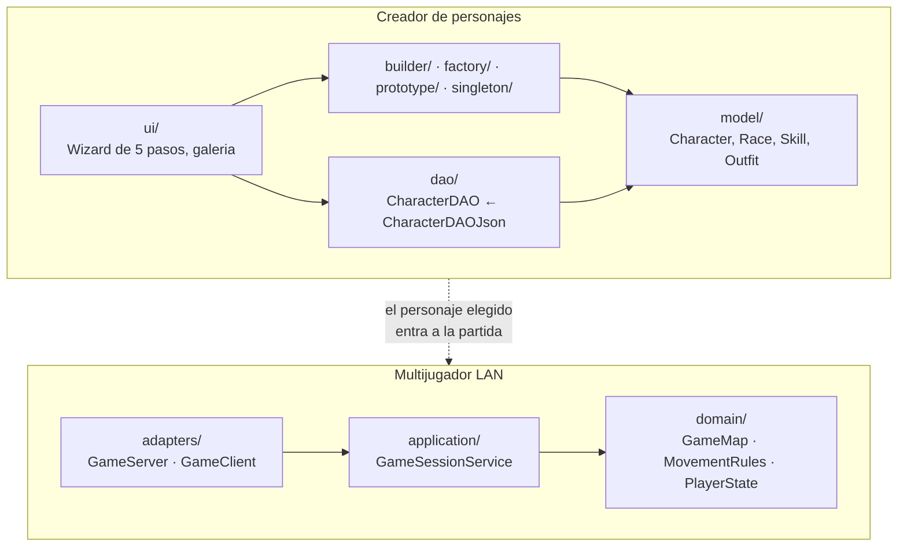
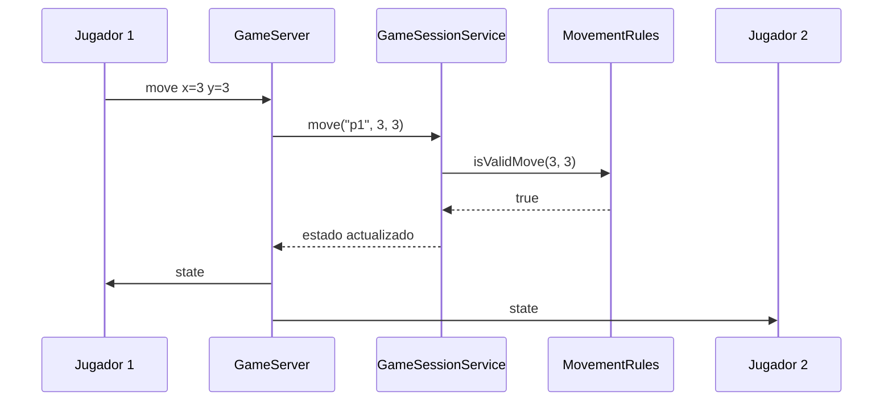

# Arquitectura

## Estilo elegido

El sistema combina dos estilos, uno por cada parte del problema.

El creador de personajes es una aplicación de escritorio en capas. La interfaz JavaFX (`ui/`) no conoce el formato de almacenamiento: habla con la interfaz `CharacterDAO`, y el catálogo se lo sirve `CatalogManager`. Las reglas de qué raza puede usar qué habilidad viven en `model/`, no en los controladores.

El multijugador es cliente-servidor con servidor autoritativo, organizado en puertos y adaptadores. El dominio (`domain/`) no conoce ni JavaFX ni la red; el caso de uso (`application/GameSessionService`) es la única fuente de verdad del estado; y los adaptadores (`adapters/`) traducen entre WebSocket y ese caso de uso. La decisión está en [ADR-001](adr/ADR-001-multijugador-lan.md).

La razón de que convivan es que resuelven problemas distintos. El creador es una sesión de un solo usuario sobre un archivo local, donde el riesgo es acoplar la UI al almacenamiento. El multijugador es estado compartido entre procesos, donde el riesgo es que dos jugadores vean cosas distintas.

## Comparación con otras opciones

### Para el multijugador: cliente-servidor frente a punto a punto

| | Punto a punto | Cliente-servidor autoritativo |
|---|---|---|
| Quién tiene el estado real | Cada cliente el suyo | Solo el servidor |
| Consistencia | Dos jugadores pueden ver mapas distintos | Todos ven lo mismo por construcción |
| Cómo se prueba | Hay que levantar N clientes y comparar | Se prueba el servidor solo, con pruebas unitarias |
| Trampas | Un cliente modificado se mueve donde quiera | El servidor valida cada movimiento |
| Punto único de falla | No lo hay | El servidor lo es |

Se eligió cliente-servidor. El argumento decisivo no fue el rendimiento sino la testabilidad: con el estado en un solo sitio, la regla de movimiento se prueba sin levantar red, y la prueba de integración solo tiene que verificar que ese estado llega a los demás.

El costo se pagó y está medido: si el jugador que hace de servidor cierra la aplicación, la partida termina para todos.

### Para el catálogo: datos en JSON frente a datos en código

| | Enum y switch en Java | Catálogo en JSON |
|---|---|---|
| Agregar una raza | Editar `RaceFactory`, recompilar | Añadir una entrada al archivo |
| Errores de escritura | Los detecta el compilador | Aparecen al arrancar |
| Quién puede editarlo | Alguien que programe | Cualquiera del equipo |

Se eligió JSON. La decisión está en [ADR-002](adr/ADR-002-catalogo-en-json.md).

### Para la persistencia: archivo JSON frente a base de datos

Se eligió un archivo JSON detrás de la interfaz `CharacterDAO`. La interfaz es lo que hace reversible la decisión: cambiar a SQLite es escribir `CharacterDAOSqlite implements CharacterDAO` sin tocar la interfaz gráfica. Está en [ADR-003](adr/ADR-003-persistencia-en-archivo.md).

## Capas

La flecha punteada es la única conexión entre las dos partes: el jugador elige un personaje guardado y sus datos viajan en el mensaje `join`.

## Un movimiento, de punta a punta

Si `MovementRules` responde `false`, el estado no cambia y el servidor difunde el estado anterior. El cliente no decide nada: dibuja lo que le llega.

## Más diagramas

Los diagramas C4 del multijugador (contexto, contenedores y componentes del servidor) están en [`diagramas/c4.md`](diagramas/c4.md).

El diagrama de clases del creador de personajes está en [`diagramas/UML.png`](diagramas/UML.png). Muestra los siete paquetes del Corte 1 y las dependencias entre ellos.

## Límites conocidos del diseño

El servidor acepta cualquier casilla caminable como destino, sin comprobar que sea vecina de la posición actual. Un cliente modificado puede recorrer el mapa de un mensaje. Hay una prueba escrita y desactivada que lo documenta.

El servidor también crea al jugador si recibe un `move` de alguien que nunca hizo `join`. Misma situación: prueba escrita y desactivada.

El estado completo se difunde a todos en cada movimiento. Con pocos jugadores no importa; las mediciones muestran que el sistema se cae entre 32 y 48 jugadores por el volumen de tráfico, no por la CPU. Ver [`docs/pruebas.md`](pruebas.md).

`GameClient` y `ClientMain` declaran el paquete `com.proyecto.rpg.adapters.client` pero los archivos están en `adapters/server/client/`. Compila porque Maven le pasa la lista de archivos a `javac`, pero la carpeta y el paquete no coinciden, y cualquier herramienta que recorra el árbol por paquetes se confunde. Mover los dos archivos a `adapters/client/` lo arregla sin tocar código.

`CatalogManager` cachea el catálogo al arrancar. Si alguien edita un JSON con la aplicación abierta, los cambios no se ven hasta reiniciar.
