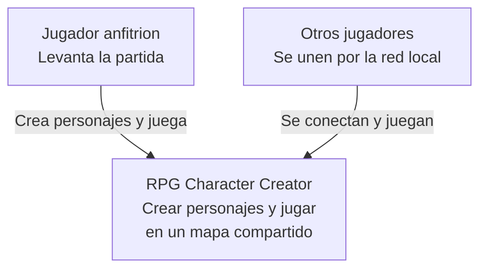
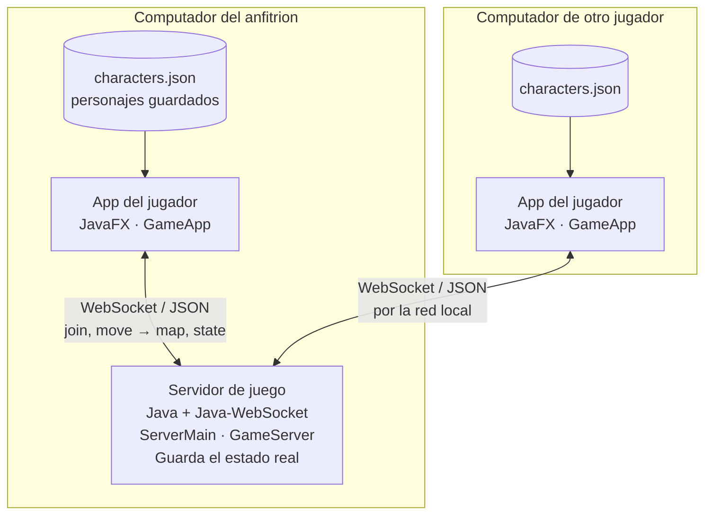
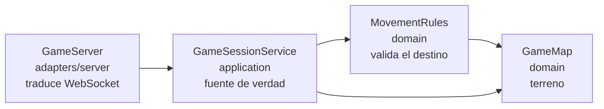

# Diagramas C4 del multijugador LAN

Acompañan al [ADR-001](../adr/ADR-001-multijugador-lan.md).

## Nivel 1: contexto

Quién usa el sistema y para qué.

## Nivel 2: contenedores

Qué procesos hay y cómo hablan entre ellos.

Cada jugador tiene su propio `characters.json`: los personajes son locales, y lo único que viaja por la red es el estado de la partida.

## Nivel 3: componentes del servidor

Las flechas apuntan hacia dentro. `domain` no conoce a `application`, y `application` no conoce WebSocket: por eso las reglas se prueban sin levantar red.

## Diagrama de clases del creador

El diagrama de clases del Corte 1, con los siete paquetes del creador de personajes, está en [`UML.png`](UML.png).
